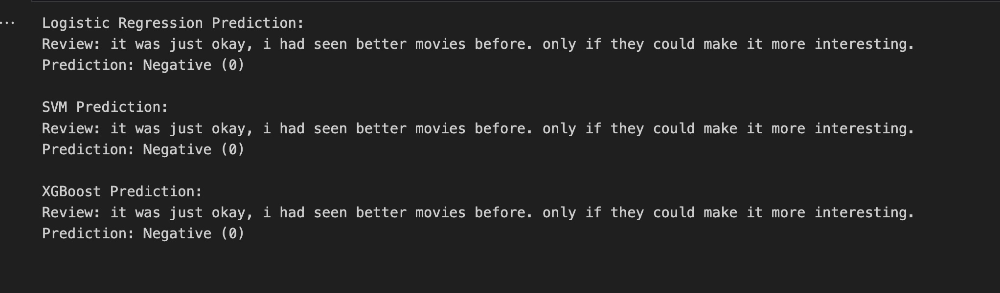
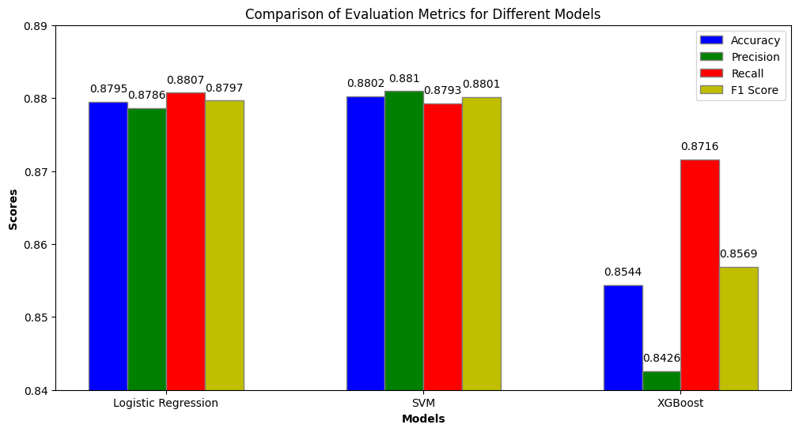

# Sentiment Analysis System for Movie Reviews


## Project Title
**Sentiment Analysis System for Movie Reviews Using Traditional Machine Learning and Self-Training**

## Description
Developed a sentiment analysis system using scikit-learn and XGBoost to accurately classify movie reviews as positive or negative, addressing class imbalance with appropriate techniques to improve customer feedback analysis.

## Table of Contents
- [Installation](#installation)
- [Usage](#usage)
- [Technical Summary](#technical-summary)
- [Analysis](#analysis)
- [Challenges](#challenges)
- [Solutions](#solutions)
- [Conclusion](#conclusion)
- [Improvements and Future Work](#improvements-and-future-work)
- [Serialization and Streamlit App](#serialization-and-streamlit-app)
- [Acknowledgements](#acknowledgements)

## Installation

### Prerequisites
- Python 3.8 or higher
- Visual Studio Code (VS Code)
- Jupyter Notebook extension for VS Code
- Git

### Clone the Repository and Set Up Environment
```sh
# Clone the repository
git clone https://github.com/thehamzza/Sentiment-Analysis-of-Movie-Reviews-with-ML.git
cd sentiment-analysis-system

# Create and activate a virtual environment
python3 -m venv venv
source venv/bin/activate  # On Windows use `venv\Scripts\activate`

# Install required packages
pip install -r requirements.txt

# Download and extract the dataset
wget https://ai.stanford.edu/~amaas/data/sentiment/aclImdb_v1.tar.gz
mkdir data
tar -xvzf aclImdb_v1.tar.gz -C data
```

## Usage

### Running the Jupyter Notebook in VS Code
1. **Open the Project in VS Code**:
   - Start VS Code.
   - Open the project folder (`sentiment-analysis-system`).

2. **Set Up Python Interpreter**:
   - Press `Ctrl+Shift+P` (or `Cmd+Shift+P` on macOS) to open the Command Palette.
   - Type `Python: Select Interpreter` and select the virtual environment you created (`venv`).

3. **Install Jupyter Extension**:
   - If you haven't already, install the Jupyter extension for VS Code from the Extensions view (`Ctrl+Shift+X`).

4. **Open and Run the Notebook**:
   - Navigate to the `main.ipynb` file in the Explorer view.
   - Click on the file to open it.
   - Click on the `Run All` button at the top to execute all cells in the notebook, or run cells individually.

### Running the Analysis
1. Follow the instructions in the Jupyter Notebook to:
   - Load and preprocess the dataset.
   - Train the models (Logistic Regression, SVM, XGBoost).
   - Handle class imbalance.
   - Evaluate the models.
   - Perform self-training with unsupervised data.

# Technical Summary

### Data Preprocessing
1. **Loading the Dataset**: Loaded 50,000 movie reviews (25,000 train and 25,000 test) and additional 50,000 unlabeled documents for unsupervised learning.
2. **Cleaning the Data**: Removed stop words, punctuation, and performed lemmatization using NLTK.
3. **Feature Extraction**: Converted text data into numerical features using TF-IDF with 5000 features.

### Model Selection and Training
1. **Logistic Regression**: Trained using class weights to handle imbalance.
2. **Support Vector Machine (SVM)**: Trained with class weights to handle imbalance.
3. **XGBoost**: Trained with `scale_pos_weight` to handle class imbalance.

### Class Imbalance Handling
1. Used class weights to balance the training process for Logistic Regression and SVM.
2. Applied `scale_pos_weight` for XGBoost to handle class imbalance.

### Evaluation Metrics
- **Accuracy**
- **Precision**
- **Recall**
- **F1 Score**

### Using Unlabeled Data for Testing
1. Preprocessed the unlabeled data in the same way as the labeled data.
2. Used the trained models to predict the sentiments of the unlabeled data.
3. Conducted exploratory analysis to understand the model's behavior and consistency on unlabeled data.

### Testing User Input Review
We tested the models on a live user input review with ambiguous language to evaluate their performance. 
The review was: "It was just okay, I had seen better movies before. Only if they could make it more interesting." 
Despite the unclear sentiment, all three models (Logistic Regression, SVM, XGBoost) correctly predicted it as Negative (0). 
This demonstrates the models' accuracy and robustness, even with challenging and confusing inputs, ensuring reliable sentiment analysis for real-world applications.


### Results
- **Logistic Regression**
  - Accuracy: 0.87952
  - Precision: 0.8786113328012769
  - Recall: 0.88072
  - F1 Score: 0.87966440271674
- **SVM**
  - Accuracy: 0.88024
  - Precision: 0.8809714652132093
  - Recall: 0.87928
  - F1 Score: 0.8801249199231262
- **XGBoost**
  - Accuracy: 0.8544
  - Precision: 0.8426140757927301
  - Recall: 0.8716
  - F1 Score: 0.8568619740464019

#### Comparison of Evaluation Metrics for Models


## Analysis

### Logistic Regression vs. SVM
- **SVM** had slightly better performance metrics due to its ability to find an optimal separating hyperplane, leading to better generalization.
- Both models performed well, likely due to the linear separability of the data after TF-IDF transformation.

### XGBoost
- **XGBoost** requires careful tuning. The default parameters might not have been optimal for this dataset.
- Potential overfitting without proper tuning, leading to lower performance on the test data.
- Further adjustments and techniques might be needed for better handling of class imbalance.

## Challenges
1. **Preprocessing the Text Data**:
   - During preprocessing, some words were losing characters, which affected the quality of the data. This issue was particularly challenging as it could impact the model's performance.
   - Example: "movie" was becoming "movi" and "characters" was becoming "charact".
   
2. **Handling Class Imbalance**:
   - The dataset could have an imbalance between positive and negative reviews, requiring techniques to ensure balanced learning, causing the model to be biased towards the majority class.
   - This imbalance could lead to inaccurate predictions, especially for the minority class (e.g., fewer negative reviews).

## Solutions
1. **Text Preprocessing**:
   - Used NLTK for text preprocessing, including stop word removal, punctuation removal, and lemmatization.
   - Implemented various methods and refined preprocessing steps to preserve the integrity of the words.
   - Example: Ensured that lemmatization was done correctly and stopwords were removed without altering meaningful parts of the text.

2. **Class Imbalance**:
   - Applied class weights to the models to handle class imbalance.
   - Used `class_weight='balanced'` for Logistic Regression and SVM, to automatically adjust weights inversely proportional to class frequencies.
   - Set `scale_pos_weight` to balance the weight of the positive class.

3. **Improved Accuracy**:
   - These techniques ensured that the models considered both classes fairly, leading to more accurate and robust predictions.
Here are the revised sections with simpler and more concise wording:

### Conclusion
The SVM model delivered the best results across accuracy, precision, and F1 score. Class imbalance was well-managed using class weights. Logistic Regression also performed strongly, while XGBoost lagged behind. The project addressed preprocessing challenges, resulting in a reliable sentiment analysis system that effectively uses labeled and unlabeled data.

### Improvements and Future Work

#### Model Optimization
Future improvements can explore more advanced models like LSTM and BERT, known for superior performance in NLP tasks. Fine-tuning using hyperparameter optimization (e.g., grid search) can further boost accuracy.

#### Semi-Supervised Learning
Incorporating semi-supervised methods like self-training and label propagation could leverage the abundant unlabeled data to enhance performance. Unsupervised techniques like clustering can also provide deeper insights.

#### Advanced Preprocessing and Feature Extraction
Enhancing text preprocessing, especially handling negations, and using better feature extraction methods like Word2Vec or BERT embeddings can improve model accuracy and robustness.

### Serialization and Streamlit App

#### Why Serialization?
The SVM model was serialized for easy deployment since it performed best in terms of accuracy, precision, and F1 score. This allows the model and vectorizer to be used in production without retraining, enabling quick predictions.

#### Streamlit App
We created a Streamlit app for users to interactively test the sentiment analysis model. Users can input movie reviews and get instant predictions. Test the app at [movie.streamlit.app](https://movie.streamlit.app).

### Acknowledgements
- The project uses the Large Movie Review Dataset provided by Stanford AI Lab.
- Developed using Python, scikit-learn, NLTK, and XGBoost.
- Thanks to the dataset authors for making it available for research purposes.
